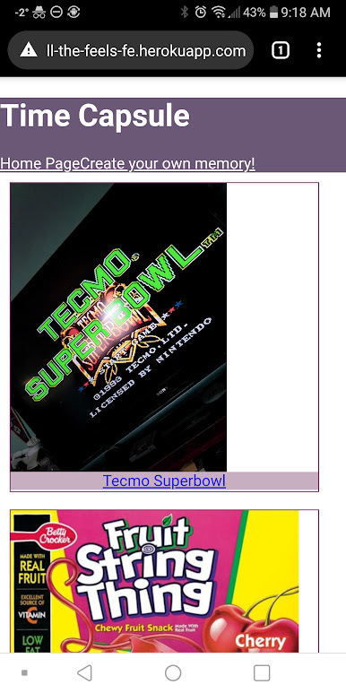

# All The Feels
Meant to be a virtual time capsule, users of this app will be able to submit old toys, games, candies, etc. from their childhood. Anyone who uses the app will also be able to browse other user submissions. All The Feels is intended to be a "feel good" site for people to look back on things in their past and can inspire discussions with friends about things from the past they may not know about! 
## Technologies Used
- All the Feels was created with React JS for the front end of the application, and utilizes Node, Express, and Mongoose for the back end to create an API and serve information to the application.
## App Features 
- All The Feels utilizes CRUD in order to allow the user to 
> - Create new memories in the app, 
> - Read submissions added by other users, 
> - Update their submissions, or 
> - Delete submissions they added

## Installation Instructions 
- Create a new folder on your computer with `mkdir all-the-Feels`.
- Fork and clone both the [Front](https://github.com/Kid-Then-Kid-Now/front-end) and [Back](https://github.com/Kid-Then-Kid-Now/back-end) ends into this directory.
- Inside the folder of each repository, run `npm install`. 
- In the back end folder, in the terminal run `node .db/seed.js` to start the back end server. 
- Navigate to the front end and run `code .`
- In your code editor (VS Code), run `start` under NPM Scripts
## Contribution Guidelines
- The application can be accessed at [All The Feels](https://all-the-feels-fe.herokuapp.com/) on Heroku.
- If there is a bug with the app, please provide the following information when submitting a bug report.
> - What you were attempting to do (add submission, update, etc.)
> - Device used (PC, mobile device)
> - Screenshots
> - Steps to recreate the error